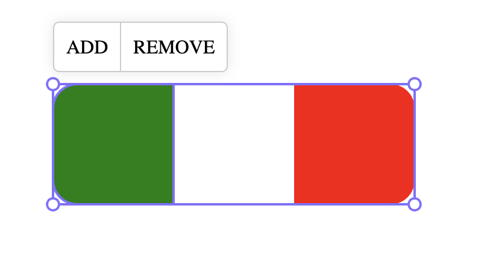

# leafer-x-edit-toolbar

Leafer 编辑辅助工具栏插件，[在线体验](https://jiyushao.github.io/leafer-x-edit-toolbar/)



## 安装

```bash
npm install leafer-x-edit-toolbar
```

## 配置定义

```typescript
export type IConfig = {
  /**
   * 自定义容器类名
   */
  className?: string
  /**
   * 自定义容器，建议与 leafer 渲染点在同一层级
   */
  container?: HTMLDivElement
  /**
   * 是否跟随缩放
   */
  followScale?: boolean
  /**
   * 是否显示 toolbar
   */
  shouldShow?: (node: ILeaf) => boolean
  /**
   * 渲染 toolbar 内容
   */
  onRender: (node: ILeaf, container: HTMLDivElement) => void
}
```

## 基础使用

```typescript
import { App, Rect } from 'leafer-ui'
import { Editor } from '@leafer-in/editor'

import { EditToolbarPlugin } from 'leafer-x-edit-toolbar'

// 创建 app 实例
const app = new App({ view: window })

app.tree = app.addLeafer()
app.sky = app.addLeafer({ type: 'draw', usePartRender: false })

// 创建编辑器实例
app.editor = new Editor()

// 创建并添加插件实例
const pluginIns = new EditToolbarPlugin(app, {
  className: 'edit-toolbar',
  followScale: true,
  shouldShow: (node) => {
    console.log('node', node)
    return true
  },
  onRender(node, container) {
    container.innerHTML = `<ul style="list-style: none; margin: 10px 0; padding: 5px; background-color: #fff; border-radius: 5px; border: 1px solid #ccc; box-shadow: 0 0 10px rgba(0, 0, 0, 0.1);">
      <li>节点类型：${node.tag}</li>
      <li>宽度：${node.width}</li>
      <li>高度：${node.height}</li>
    </ul>
    `
  },
})

// 添加编辑器到画布
app.sky.add(app.editor)

// 添加矩形
app.tree.add(
  Rect.one(
    { editable: true, fill: 'green', cornerRadius: [20, 20, 20, 20] },
    200,
    200
  )
)
```

## API 文档

### 构造函数

```typescript
constructor(app: App, config: IConfig)
```

#### 参数

- `app`: Leafer App 实例
- `config`: 插件配置项

#### 配置项

| 属性          | 类型                                             | 默认值       | 说明                                       |
| ------------- | ------------------------------------------------ | ------------ | ------------------------------------------ |
| `className`   | string                                           | 无           | 自定义容器类                               |
| `container`   | HTMLDivElement                                   | 无           | 自定义容器，建议与 leafer 渲染点在同一层级 |
| `followScale` | boolean                                          | `false`      | 是否跟随缩放                               |
| `shouldShow`  | (node: ILeaf) => boolean                         | `() => true` | 是否显示 toolbar                           |
| `onRender`    | (node: ILeaf, container: HTMLDivElement) => void | 无           | 渲染 toolbar 内容                          |

### 实例方法

#### destroy()

销毁 Edit Toolbar 和事件监听

```typescript
pluginIns.destroy()
```
